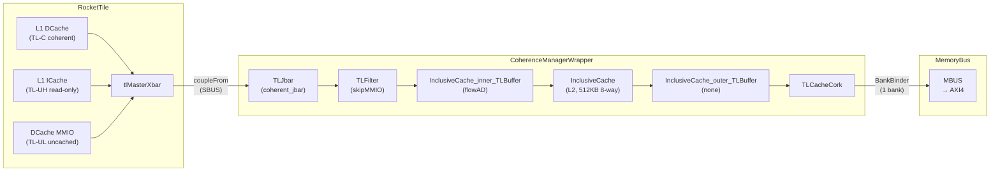
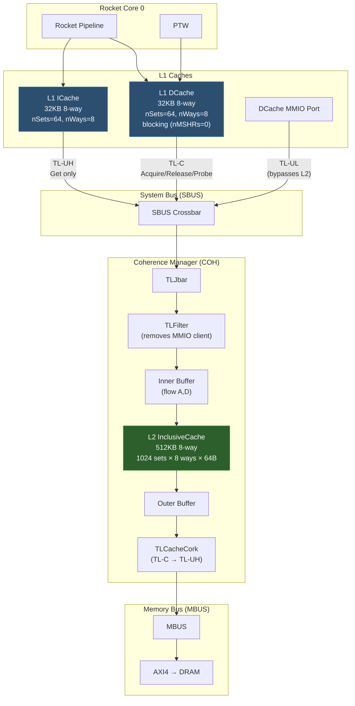

# SiFive InclusiveCache (LLC) — RocketConfig Analysis

## 1. Config Composition for `RocketConfig`

The `RocketConfig` is defined as:

```scala
class RocketConfig extends Config(
  new freechips.rocketchip.rocket.WithNHugeCores(1) ++  // single rocket-core
  new chipyard.config.AbstractConfig)
```

The `AbstractConfig` includes (among many things):

```scala
new freechips.rocketchip.subsystem.WithInclusiveCache ++      // L2 coherence manager
new freechips.rocketchip.subsystem.WithCoherentBusTopology ++ // sbus → coh → mbus hierarchy
```

Since `WithInclusiveCache` is instantiated with **default parameters**, the LLC for `RocketConfig` has the following configuration:

| Parameter | Value | Notes |
|---|---|---|
| `nWays` | **8** | 8-way set-associative |
| `capacityKB` | **512** | 512 KiB total capacity |
| `nBanks` | **1** | Default from `SubsystemBankedCoherenceKey` |
| `sets` | **128** | `(512 × 1024) / (64 × 8 × 1) = 1024` |
| `blockBytes` | **64** | From `CacheBlockBytes` (global) |
| `beatBytes` | **8** | From `SystemBusKey.beatBytes` |
| `writeBytes` | **8** | Backing store update granularity |
| `portFactor` | **4** | Sub-banking factor |
| `memCycles` | **40** | Memory round-trip latency estimate |
| `level` | **2** | This is the L2 cache |

> [!NOTE]
> The set count is computed dynamically: `sets = (capacityKB * 1024) / (CacheBlockBytes * nWays * nBanks)`.
> With 1 bank, 64B blocks, 8 ways: `sets = 524288 / (64 × 8 × 1) = 1024`.

---

## 2. Bus Topology: How the L2 Connects

The `WithCoherentBusTopology` config creates the following bus hierarchy:

```
CoherentBusTopologyParams(
  mbus = MemoryBusParams,
  coherence = SubsystemBankedCoherenceKey,  // ← overridden by WithInclusiveCache
  sbusToMbusXType = NoCrossing
)
```

This instantiates:
1. **SBUS** (System Bus) — the central interconnect that tiles couple to
2. **COH** (Coherence Manager Wrapper) — wraps the InclusiveCache L2
3. **MBUS** (Memory Bus) — connects to external DRAM controllers

The connection order is:

```
SBUS  →(BIND_STAR)→  COH  →(crossTo)→  MBUS  →  AXI4 Memory
```

---

## 3. Upper-Level Coherent Agents (for single-core RocketConfig)

### 3.1 Inside the RocketTile

The `WithNHugeCores(1)` config creates a single `RocketTile` containing:

| Agent | TL Client Name | Source IDs | TL Protocol | Description |
|---|---|---|---|---|
| **L1 DCache** | `"Core 0 DCache"` | `[0, 0)` (blocking, nMSHRs=0, so 1 source) | **TL-C** (supportsProbe) | Coherent data cache. Issues `AcquireBlock`/`AcquirePerm`, responds to `Probe` |
| **L1 DCache MMIO** | `"Core 0 DCache MMIO"` | `[1, 2)` | **TL-UL** (requestFifo) | Uncached MMIO port for device-space loads/stores |
| **L1 ICache** | `"Core 0 ICache"` | `[0, 1)` | **TL-UH** (Get only) | Read-only instruction cache. Issues `Get` for refills; **no** `Acquire`/`Probe` support |

> [!IMPORTANT]
> The L1 DCache is the **only true coherent client** in a basic single-core RocketConfig.  
> It supports the TL-C (cached/coherent) protocol with `supportsProbe = TransferSizes(64, 64)`.  
> The L1 ICache only uses `Get` (TL-UH) and does not participate in the coherence protocol — it relies on `FENCE.I` for cache invalidation.

### 3.2 The Connection Chain Inside the Tile

```
┌─ RocketTile ──────────────────────────────────────────────────┐
│                                                                │
│  DCache.node ──→ TLWidthWidget(rowBits/8) ──→ tlMasterXbar    │
│  ICache.masterNode ──→ TLWidthWidget(rowBits/8) ──→ tlMasterXbar │
│  (RoCC.atlNode ──→ tlMasterXbar, if present)                  │
│                                                                │
│  tlMasterXbar.node ──→ tlOtherMastersNode ──→ masterNode      │
│                              (= visibilityNode)                │
└────────────────────────────────────────────────────────────────┘
```

The tile's `masterNode` is then connected to the SBUS via `connectMasterPorts`:

```scala
// in CanAttachTile.connectMasterPorts:
dataBus.coupleFrom("rockettile") { bus =>
  bus :=* crossingParams.master.injectNode(context) :=* domain.crossMasterPort(crossingType)
}
```

Where `dataBus` = SBUS (the default `where` for `HierarchicalElementMasterPortParams`).

---

## 4. The L2 Coherence Manager Pipeline

The `WithInclusiveCache` config overrides `SubsystemBankedCoherenceKey.coherenceManager` to inject the following pipeline between the SBUS inward node and the MBUS outward node:



### 4.1 Key Components in the Pipeline

#### TLJbar (`coherent_jbar`)
- Part of the `CoherenceManagerWrapper`
- A TileLink joining crossbar that merges all SBUS inputs into the coherence manager's inward node
- This is where multiple tile master ports get aggregated

#### TLFilter (`skipMMIO`)
- **Filters out the DCache's MMIO client** from the coherent path
- The filter function ([Configs.scala:109-115](file:///home/damith/Research/repos/chipyard_performance_eval/chipyard/generators/rocket-chip-inclusive-cache/design/craft/inclusivecache/src/Configs.scala#L109-L115)):
  ```scala
  def skipMMIO(x: TLClientParameters) = {
    val dcacheMMIO =
      x.requestFifo &&
      x.sourceId.start % 2 == 1 &&
      x.nodePath.last.name == "dcache.node"
    if (dcacheMMIO) None else Some(x)
  }
  ```
- This removes the `"Core 0 DCache MMIO"` client (which has `requestFifo=true`, odd sourceId start=1, and comes from `dcache.node`)
- MMIO traffic bypasses the L2 entirely

> [!TIP]
> The MMIO filter ensures that device-space (uncached) memory accesses from the DCache do **not** pollute the L2 cache. Only coherent (cached-region) traffic enters the InclusiveCache.

#### Inner Buffer (`bufInnerExterior = flowAD`)
- Inserts flow buffers on **A** (request) and **D** (response) channels
- Helps timing closure between the SBUS crossbar and the L2 scheduler

#### InclusiveCache (L2)
- The actual L2 cache: **512KB, 8-way set-associative, inclusive**
- Acts as both a **cache** and the **coherence point** (root of the coherence tree)
- On the **inner (client-facing) side**: accepts TL-C `Acquire`/`Release` and issues `Probe`/`Grant`
- On the **outer (manager-facing) side**: issues TL-C `AcquireBlock`/`AcquirePerm` and `ReleaseData` toward the memory controller
- The `TLAdapterNode` advertises:
  - `supportsAcquireB` and `supportsAcquireT` for cacheable regions
  - `supportsGet`, `supportsPutFull`, `supportsPutPartial` for all regions

#### Outer Buffer (`bufOuterExterior = none`)
- No additional buffering on the outer (memory-side) path by default

#### TLCacheCork
- Converts between TL-C (cached/coherent) protocol and TL-UH (uncached/hinted) protocol
- Necessary because the memory bus (MBUS) and downstream AXI4 do not understand cache coherence
- Effectively "corks" the coherence — no probes can come from the memory controller
- This is the **last-level node** in the coherence hierarchy

---

## 5. Client Map as Seen by the L2

At elaboration time, the InclusiveCache prints a client map. For `RocketConfig`, the clients visible to the L2 (after the `TLFilter` removes MMIO) are:

```
L2 InclusiveCache Client Map:
    0 <= Core 0 DCache
    1 <= Core 0 ICache
```

| Client Index | Client Name | Protocol | Coherent? | Notes |
|---|---|---|---|---|
| 0 | `Core 0 DCache` | TL-C | ✅ Yes | Can be probed; issues Acquire/Release |
| 1 | `Core 0 ICache` | TL-UH | ❌ No | Read-only Get; never probed by L2 |

> [!NOTE]
> The DCache MMIO client is **stripped** by the `TLFilter` and is **not** visible to the L2. MMIO requests travel through a separate path that bypasses the cache hierarchy entirely.

---

## 6. Coherence Flow Summary

### Cache Hit (L1 DCache)
1. Core issues load/store → L1 DCache hit → no bus transaction

### L1 DCache Miss → L2 Hit
1. L1 DCache issues `AcquireBlock(NtoB)` or `AcquireBlock(NtoT)` via TileLink-C
2. Request flows: `DCache → tlMasterXbar → SBUS → JBar → TLFilter → InnerBuffer → L2`
3. L2 hits → responds with `GrantData` (or `Grant`) back to L1 DCache
4. L1 DCache sends `GrantAck` to complete the transaction

### L1 DCache Miss → L2 Miss
1. Same as above, but L2 also misses
2. L2 issues `Get`/`AcquireBlock` outward: `L2 → OuterBuffer → TLCacheCork → BankBinder → MBUS → DRAM`
3. DRAM responds → L2 fills the line → L2 responds to L1

### L1 ICache Miss → L2
1. L1 ICache issues `Get` (not `Acquire` — ICache is read-only, non-coherent)
2. L2 services the Get like any other read request
3. If L2 misses, it fetches from DRAM on behalf of the ICache

### L2 Probe (Multi-core scenario)
- When another core acquires exclusive access to a line held by Core 0's DCache, the L2 issues a `Probe` to Core 0
- Core 0's DCache may respond with `ProbeAck` (clean) or `ProbeAckData` (dirty writeback)
- **The ICache is never probed** — it does not participate in the coherence protocol

---

## 7. L2 Control Port

The L2 has an optional MMIO control port for cache flush operations:

```scala
l2.ctrls.foreach {
  _.ctrlnode := cbus.coupleTo("l2_ctrl") {
    TLBuffer(1) := TLFragmenter(cbus, Some("LLCCtrl")) := _
  }
}
```

- Connected to the **CBUS** (Control Bus)
- Default address: `InclusiveCacheParameters.L2ControlAddress` (typically `0x2010000`)
- Supports programmatic cache flush via MMIO writes

---

## 8. Summary Diagram


